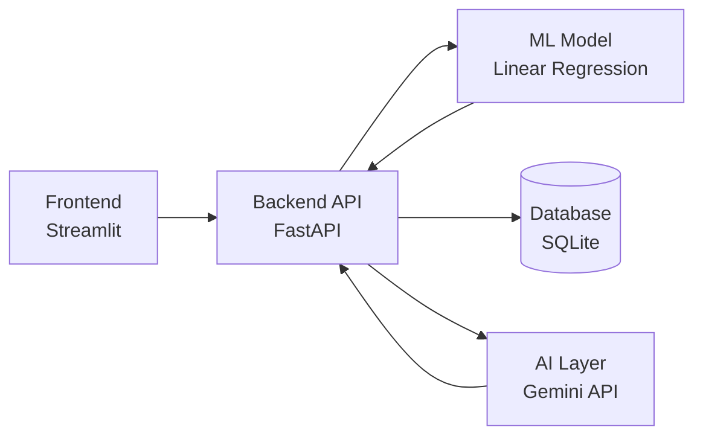

# 🚖 NYC Taxi Fare & Revenue Advisor

An ML + AI powered tool that predicts taxi fares from trip details and gives drivers AI-generated tips for maximizing earnings, backed by analysis of 2.3M+ cleaned NYC taxi trips.

## 🎯 What it does

1. Driver enters trip distance, duration, passenger count, and payment type
2. A trained **Linear Regression model (R² = 0.98)** predicts the fare
3. **Google Gemini** generates a practical tip based on the prediction and historical earning patterns
4. Every prediction is saved to a database
5. A dashboard shows real analytics from the historical dataset — fare distribution, Card vs Cash comparison, distance correlation

## 🏗️ Architecture



- **Frontend**: Streamlit — fare estimator, prediction history, analytics dashboard
- **Backend**: FastAPI — REST API with interactive docs (`/docs`)
- **ML**: scikit-learn Linear Regression, trained on 2.3M+ cleaned trip records, R² = 0.98
- **AI**: Google Gemini generates driver-facing earning tips, with retry logic and graceful fallback
- **Database**: SQLite + SQLAlchemy — every prediction stored
- **Testing**: pytest suite covering all endpoints

## 📊 Dataset & Model

- Source: NYC Yellow Taxi trip records (6.4M raw rows, [data.world](https://data.world))
- Cleaned using IQR outlier removal on fare, distance, and duration → 2.3M valid rows
- A 100,000-row sample is committed to the repo (`data/taxi_data_clean.csv`) for fast local dashboard loading
- Model trained on the full cleaned dataset: **MAE 0.44, MSE 0.62, R² 0.98**
- Key finding: trip distance is the strongest predictor of fare; Card payments average ~12% higher fares than Cash

## 📁 Project Structure

```
NYC-Yellow-Taxi/
├── backend/
│   ├── main.py          # FastAPI app and routes
│   ├── ml_service.py     # Fare prediction + dashboard stats
│   ├── ai_service.py     # Gemini driver tip generation
│   ├── database.py       # DB connection setup
│   ├── models.py         # SQLAlchemy table definitions
│   └── schemas.py        # Request/response validation
├── frontend/
│   └── app.py            # Streamlit UI
├── scripts/
│   └── prepare_and_train.py  # One-time data cleaning + model training
├── data/
│   └── taxi_data_clean.csv   # Cleaned 100k-row sample
├── ml_models/
│   └── fare_model.pkl        # Trained regression model
├── tests/
│   └── test_api.py
└── requirements.txt
```

## 🚀 Running Locally

**1. Clone and set up environment**
```bash
git clone https://github.com/Divyani-Mali/NYC-Yellow-Taxi.git
cd NYC-Yellow-Taxi
python -m venv venv
venv\Scripts\activate
pip install -r requirements.txt
```

**2. Add your Gemini API key**

Copy `.env.example` to `.env` and add your key:
```
GEMINI_API_KEY=your_key_here
```

**3. Run the backend**
```bash
uvicorn backend.main:app --reload
```

**4. Run the frontend** (separate terminal)
```bash
streamlit run frontend/app.py
```

> Note: the model and cleaned sample are already included in this repo — you don't need to re-run `scripts/prepare_and_train.py` unless you want to retrain from scratch.

## 🔌 API Endpoints

| Method | Endpoint | Description |
|--------|----------|-------------|
| POST | `/predict` | Predict fare from trip details, get an AI tip |
| GET | `/history` | Recent prediction history |
| GET | `/dashboard-stats` | Historical analytics (fare distribution, correlation, payment split) |
| GET | `/usage-stats` | Live usage stats (total predictions, average fare) |

## 🧪 Running Tests

```bash
pytest tests/ -v
```

## 🔮 Future Improvements

- Add time-of-day and location features for more granular fare/demand prediction
- Try ensemble models (Random Forest, Gradient Boosting) and compare against the linear baseline
- Deploy to cloud (Render/Railway for backend, Streamlit Cloud for frontend)